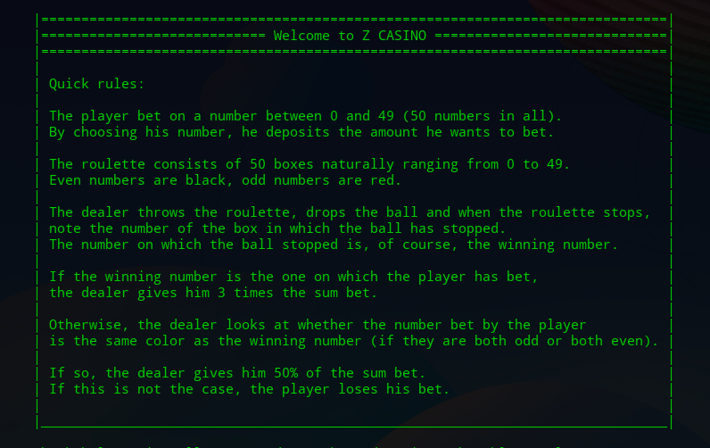

# A simple roulette game simulator created with Python - Z Casino

This work was done as a project for [Open Classrooms](https://openclassrooms.com/).

The goal was to build a simple roulette game simulator script with Python3.

## Requirements

To use the script, you need any version of Python3 installed on your computer. (Python 2.0+ don't gonna work)

1. First of all `git clone the repo`
2. Run `$ cd z_casino`
3. Run `$ python3 ./casino/casino.py` to launch the game

## Quick Game Rules

## Contact

Problems or questions? File an issue at [GitHub](https://github.com/nikitavasilev/z_casino/issues).
